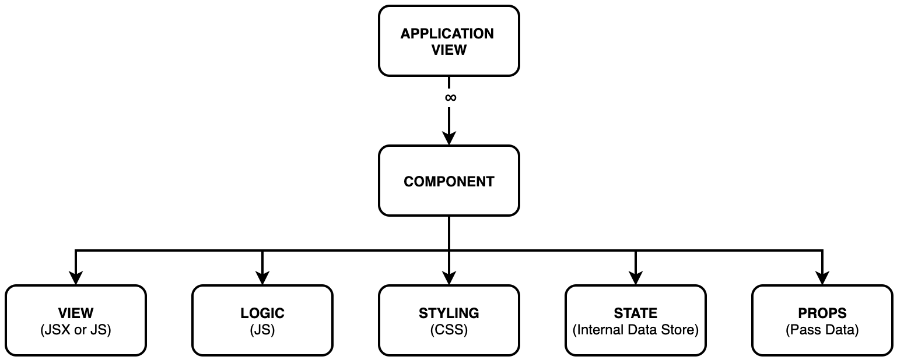

# React.JS

* Javascript library for building user interfaces
   * Uses a declarative approach 
      * Makes it easy to create interactive UIs with simple views for each state within your application
   * Automatically renders any changes to their specific components
   * Component based approach
      * Encapsulate behaviours into small units
   * Technology Stack Agnostic
      * Only the UI side of this - it does not care about the back-end server
* History
   * FB Newsfeed in 2011 by Jordan Walke
   * Designed for speed, simplicity, and scalability
* React Vocabulary
   * One-way data flow - Flux architecture
   * JSX - 
   * Components - 
   * State - 
   * Props - way of passing data between different components
   * Virtual DOM - 
   * Element - smallest unit of a React Application
   * Flux/Redux - 
   * Testing - 

## Set-up

* To use React, you can either use:
   * Yarn
      * `yarn` is better and more stable (from experience) for React applications
      * would need `node` and `yarn` installed (https://yarnpkg.com/)
        * Install `yarn` as per the website instructions
   * NPM or NPX
      * You can use `npm` or `npx`
        * `npm` vs `npx`
           * `npm` - Manager
           * `npx` - Execute; a small utility that’s smart enough to run the right application when it’s called from within a project

```
$ npm install -g create-react-app         // it will install create-react-app globally (you might need sudo)
$ create-react-app [APP_NAME]             // cd into the directory you want to create the app and create one
$ cd [APP_NAME]                           // navigate into the project dir
$ yarn start                              // run the application and it should open it in localhost:3000
```

* Developer Tools
   * **react-devtools** (https://github.com/facebook/react-devtools)
      * Extension as add-on to browser or a standalone app
      * You can see various aspects of the application including the DOM hierarchy

## Overview

### Different React "Flavours"

| Framework     | Description                                  |
|---------------|----------------------------------------------|
| react         | core; required for both web and native apps  |
| react-dom     | for web app; runs in a browser               |
| react-native  | for native app; runs on mobile device        |
| react-scripts | provides all the features (i.e. `npm start`) |

* Both the web and native apps must have the `react-dom` and `react-scripts` added in the `package.json`


## Project Structure of a React Application

* A new React Project will create the following standard structure:

```
[APP_NAME]
 |-> package.json             // specify dependencies (similar to pom.xml in java)
 |-> package-lock.json
 |-> node_modules
   |-> // where all the dependencies are stored
 |-> public
    |-> index.html            // splash page launched in the browser
 |-> src                      // contains the React code
    |-> components
      |-> // dir to add separation for the components
    |-> App.css               // -|
    |-> App.js                //  |-- all are related to the App (root) component
    |-> App.test.js           // _|

    |-> index.css             // -|-- styling that affects the entire application
    |-> index.js              // _|

    |-> logo.svg
    |-> reportWebVitals.js
    |-> setupTests.js
```

* All the dependencies specified in the `package.json` are isntalled by NPM and storedin the `node_modules` directory
* All the files in the `src` are bundled up and are used in the `index.html` to run the application

## React Components



* Create Web Apps in a modularised way
   * i.e. split the UI into individual elements as independent and reusable piece
      * e.g. In a Web App you can have separate components for app (Root component), menu, header, footer
* Each Component is independent and can be re-used on its own
* Each Component can contain other components but will always eventually roll-up into an `App` component
* Each Component must always return a `JSX`
* Basic Structure of a Component:
  ```
  // import the React and Component
  import React, { Component } from 'react';
  
  class MyOwnClass extends Component {
      
      // supply the props to the super class; this is required whenever a Class Component is defined
      constructor (props) {
          super(props);
      }
      
      // returns the corresponding view for this component
      render() {
           return (
           );
      }
  }
  
  // export your class so you can import this in another
  export default MyOwnClass;
  ```
* Each Component would have: 
   * **View:**
      * How a component should be structured
      * Described within the Class or a Function as a JSX or plain JavaScript
   * **Logic:**
      * How a component should behave (i.e. form elements)
      * Written JavaScript
      * Event Handling
         * Similar to handling DOM elements events
            * Use camelCase to specify events
            * Pass function as the event handler
            * Example:
               ```
               <Card onClick={() => this.onDishSelect(dish)}>
               ```
   * **Styling:** 
      * How a component should look like
      * Described in `[COMPONENT_NAME].css`
         * One .css file can be created for each component or it can be all added in the `index.css` component
   * **State:**
      * Each component can store its own local information in its "state"
         * Private and fully controlled by the component
         * Can be passed as `props` to children
      * Only Class Components can have local state
      * Can be to do with the initial and final state of a component
         * Intial State is typically defined in a constructor (`this.state`)
            ```
            // adding this inside of a class
            // Initial State
            constructor() {
               super();
               this.state = {
                     counter: 0
               }

               //bind the function
               this.increment = this.increment.bind(this);
            }
            ```
      * State should only be modified using `setState()` and supply the property that will be modified
         ```
         onDishSelect(dish){
            this.setState({
               selectedDish: dish
            });
         }
         ```
         * *Note: Never directly manipulate the state `this.state.selectedDish=dish;`*
      * **Lifting State Up**
         * Sometimes components may share the same data and changes to the data in one component must be reflected in another component
         * Best Approach: move the shared state to a common ancestor component
   * **Props:**
      * A way to pass JSX attributes into a component as a single object
      * You can pass multiple attributes
        * Props are arguments passed into React Components
        * Props are passed to Components via HTML attributes
      * Different ways can be used:
        * The component receives the argument as a `props` object
          ```
          // The following would return "I am a Ford" on the page
          import React from 'react';
          import ReactDOM from 'react-dom';

          class Car extends React.Component {
            render() {
              return <h2>I am a {this.props.brand}!</h2>
            }
          }

          const myelement = <Car brand="Ford" />;
          ReactDOM.render(myelement, document.getElementById('root'));

          ```
        * Pass data from one component to another, as parameters
          ```
          import React from 'react';
          import ReactDOM from 'react-dom';

          class Car extends React.Component {
            render() {
              return <h2>I am a {this.props.brand}!</h2>;
            }
          }

          class Garage extends React.Component {
            render() {
              return (
                <div>
                <h1>Who lives in my Garage?</h1>
                <Car brand="Ford" />
                </div>
              );
            }
          }

          ReactDOM.render(<Garage />, document.getElementById('root'));

          ```
        * Send a non-string variable, put the variable inside the curly braces
          ```
          // This creates a variable named "carname" and send it to the Car component
          import React from 'react';
          import ReactDOM from 'react-dom';

          class Car extends React.Component {
            render() {
              return <h2>I am a {this.props.brand}!</h2>;
            }
          }

          class Garage extends React.Component {
            render() {
              const carname = "Ford";
              return (
                <div>
                <h1>Who lives in my Garage?</h1>
                <Car brand={carname} />
                </div>
              );
            }
          }

          ReactDOM.render(<Garage />, document.getElementById('root'));
          ```
        * Send an object, put in inside the curly braces
          ```
          import React from 'react';
          import ReactDOM from 'react-dom';

          class Car extends React.Component {
            render() {
              return <h2>I am a {this.props.brand.model}!</h2>;
            }
          }

          class Garage extends React.Component {
            render() {
              const carinfo = {name: "Ford", model: "Mustang"};
              return (
                <div>
                <h1>Who lives in my garage?</h1>
                <Car brand={carinfo} />
                </div>
              );
            }
          }
          ReactDOM.render(<Garage />, document.getElementById('root'));
          ```
        * If your component has a constructor function, the props should always be passed to the constructor and also to the `React.Component` via the `super()` method
          ```
          class Car extends React.Component {
            constructor(props) {
              super(props);
            }
            render() {
              return <h2>I am a {this.props.model}!</h2>;
            }
          }

          ReactDOM.render(<Car model="Mustang"/>, document.getElementById('root'));
          ```
      * Props cannot be modified within the component
 
      * Examples:
         * Dishes are available as **props** within the Menu Component and can be accessed as `this.props.dishes`
            ```
            <Menu dishes={this.state.dishes} />
            ```
         * Dish is available as **props** within the Dishdetail Component and can be accessed as `this.props.dish` and comments as `this.props.comments`
* **custom React Component Conventions**:
   * You must always import `React` component in your class      
   * Name must be in PascalCase
      * Or at least begin with a capital letter
      * Especially when using as part of JSX. This will not compile otherwise
         * Camel case or lower case letters are treated as DOM tags
      * The components compile to `React.createElement(...)`
   * Each Component must be in its own **class file** and added in the `src/components` directory of your project
      * Each file must be have a `.jsx` extension
   * Export it to make it useable to other modules
      * Components can be exported as a default or not default component
         * Default makes use of the `default` keyword
      * There are two ways of exporting classes
         * Adding it at the end of the class
           ```
           class MyDefaultClass extends Component {
              ...
           }
           export default MyDefaultClass;
           
           ---
           
           class MyClass extends Component {
              ...
           }
           export MyClass;
           ```
         * Adding it at the class declaration
           ```
           export default class MyDefaultClass extends Component {
              ...
           }
           ---
           export class MyClass extends Component {
              ...
           }
           ```
   * Import the component where you need to use it<br/>
      
      * Components that are **exported** as a `default` component must be **imported** as a `default` component
      * Non-default components must be enclosed in `{}`
      * Example: 
         ```
         //App.js
         import React, { Component } from 'react';
         import FirstComponent, {SecondComponent, ThirdComponent} from './components/MyComponents';
         import logo from './logo.svg';
         import './App.css';
         
         class App extends Component {
            render() {
               return (
                  <div className="App">
                  Hello Kristel
                  <FirstComponent/>
                  <SecondComponent/>
                  <ThirdComponent/>
                  </div>
               );
            }
         }
         export default App;

         //MyComponents.jsx (with three components: FirstComponent, SecondComponent, and ThirdComponent)
         import React, {Component} from 'react';

         export default class FirstComponent extends Component {
            render(){
               return (
                  <div className="firstComponent">
                     First Component
                  </div>  
               );
            }
         }

         export class SecondComponent extends Component {
            render(){
               return (
                  <div className="secondComponent">
                     Second Component
                  </div>  
               );
            }
         }

         export class ThirdComponent extends Component {
            render(){
               return (
                  <div className="thirdComponent">
                     Third Component
                  </div>  
               );
            }
         }
         ```
* **React Component Lifecycle**
   * **Mounting**
      * These are called when an instance of a component is created and inserted into the DOM
         * `constructor()`
         * `getDerivedStateFromProps()`
         * `render()`
         * `componentDidMount()`
      * Deprecated Methods (NOTE: DO NOT USE!!):
         * `componentWillMount()`
   * **Updating**
      * 
   * **Un-Mounting**

### Root Component

* `root` Component is the first component that loads; typically this is called `App`
* Can be written as a Class or Function Component
* It is possible to include/attach other modules/child component
   ```
   class App extends Component {
      render(){
         return (
            <div className = "App">
               ...
               <FirstComponent/>
               <SecondComponent></SecondComponent>
            </div>
         )
      }
   }
   ```

### Class Component

* A component encapsulated in a class (i.e. Object Oriented)
* A Class component can have multiple functions
* Class Component must: 
   * Import the React component
   * Extend the class `Component` (found in the core `react`) framework
   * Implement the `render()`
   * Return the JSX
   * Be exported to be re-usable to other modules; it can be done in two ways:
      * Within the Class declaration
      * OR added right at the end of the class
   * It must be imported inside the class where it will be used
* Examples:
   ```
   import React, {Component} from 'react';
   
   // a class where it is exported in the Class declaration
   export default class [CLASS_NAME] extends Component {
      ...
      render(){
         ...
         return (
            ...
         );
      }
   }
   
   // a class where it is exported at the end of the class
   class [CLASS_NAME] extends Component{
      ...
      render(){
         ...
         return (
            ...
         );
      }
   }
   export default [CLASS_NAME];
   ```


### Functional Component

* Function can be in a class as a local function or it can just be a standalone component
   * It does not need the `function` keyword in before the function name
   * It should have `this.[FUNCTION_NAME]` notation since it is a local function
* Function Component must: 
   * Have a Function declaration
   * Return the JSX
* Newer versions of React is by default, created as a Function Component
* Examples:
   ```
   function [FUNCTION_NAME](){
      ...
      return(
         ...
      );
   }
   ```

### Presentational Components

* Mainly concerned with redering the "view"
  * How things look (markup, styles)
* Render the view based on the data that is passed to them in props
* Do not maintain their own local state
  * Can be relaxed to maintain only UI State than data

### Container Components

* Responsible for making things work
  * Data fetching, state updates
* Making use of presentational components for rendering
  * Can wrap presentational components in wrapping `divs`
* Provide the data to the presentational components
* Maintain the state and communicate with data sources

## JSX

* Syntax extension to JavaScript
   * Almost like a template language (i.e. HTML within JavaScript)
   * You write the HTML the normal way and the JavaScript must always be enclosed in `{...}`
* [Babel.js](https://babeljs.io) is the one that converts JSX into JavaScript
* Recommended to use in React to describe the View/UI should look like
* A component must always return back a JSX
* You cannot use caps in JSX --it will not compile!!
* It makes use of a `className` instead of `class`
   ```
   <span className="MyClass></span>
   ```
* All the attributes uses camelCase

### Using Methods in JSX

* When adding Javascript into JSX, it must be enclosed in `{}`
* Functions can be invoked or add a reference to it
   * Invoked - function is called automatically
   * Reference - function is called when an event occurs
   ```
   <button onClick={increment()}/>      //invoked; called when the page is loaded
   <button onClick={increment}>         //referenced; called whenever the button is clicked
   ```
   
 ## React Applications with Bootstrap
 
 * Setup: 
    * Install Bootstrap, ReactStrap and React-Popper in you project
      ```
      $ yarn add bootstrap@latest                             // install bootstrap into your React project
      $ yarn add reactstrap@latest react-popper@latest        // allows you to make use of bootstrap components in react
      ```
    * Configure your project to make use of Bootstrap by adding the imports to your `index.js` before the import of `index.css`
      ```
      ...
      import 'bootstrap/dist/css/bootstrap.min.css'
      import './index.css'
      ```
    * Then you can import the Boostrap components where required

---

# Useful Extensions

### Reactjs Code Snippet

* By charalampos karypidis
* This provies some snippets that triggers something
  * e.g. `rcc` + Tab will create a skeleton for a Component
* Full list can be found in [Visual Studio Code Marketplace - React Snippets](https://tinyurl.com/5x3rtjb9)
