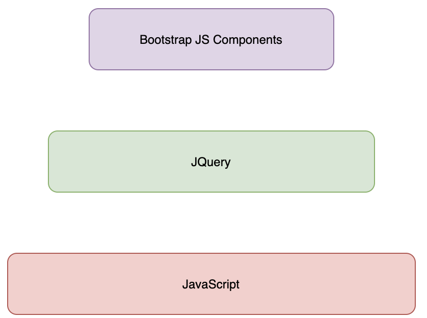

# Bootstrap

## Overview

* Front-end framework for faster and easire web development
  * HTML and CSS based design templates for typography, buttons, forms, tables, navigation, modals, image carousels and many more
* Responsive design and mobile first approach

## Set-up

* Navigate into the directory of your project and run the following command:

  ```
  //download and install the dependencies in the node_modules
  $ npm install popper.js@latest jquery@latest bootstrap@latest --save
  
  // run the application (you can use npm start but I prefer using yarn)
  $ yarn start
  ```

## Responsive Design

* Adapting to the user's **viewport** so you can view the same website in different screen sizes and layout
* Mobile First Design
  * Looks at designing a website for a mobile device first and then increasing the content/details as the size of the sceen increases as well

### Foundations for Responsive Design in Bootstrap

#### **Grid System**
  * This system can be applied using the **viewport** meta tag
    * Ensures the screen width is set to the device width and content is rendered appropriately
  * **Bootstrap Grid System**
    * https://getbootstrap.com/docs/4.6/layout/grid/
      ```
      <html>
      <head>
      ...
      <meta name="viewport" content="width=device=width,initial-scale=1, shrink-to-fit=no">
      </head>
      ...
      </html
      ```
    * Makes use of the **CSS Flexbox Layout** (https://css-tricks.com/snippets/css/a-guide-to-flexbox/)
    * Bootstrap Grid Classes:
      |                     | Extra Small <576px                      | Small ≥576px                                      | Medium ≥768px                                     | Large ≥992px                                      | Extra Large ≥1200px                               |
      |---------------------|-----------------------------------------|---------------------------------------------------|---------------------------------------------------|---------------------------------------------------|---------------------------------------------------|
      | Grid Behaviour      | Horizontal at all times                 | Collapsed to start,  horizontal above breakpoints | Collapsed to start,  horizontal above breakpoints | Collapsed to start,  horizontal above breakpoints | Collapsed to start,  horizontal above breakpoints |
      | Max container width | None (auto)                             | 540px                                             | 720px                                             | 960px                                             | 1140px                                            |
      | Class Prefix        | .col-                                   | .col-sm-                                          | .col-md-                                          | .col-lg-                                          | .col-xl-                                          |
      | No. of Columns      | 12                                      | 12                                                | 12                                                | 12                                                | 12                                                |
      | Gutter Width        | 30px (15px on each  side of the column) | 30px (15px on each  side of the column)           | 30px (15px on each  side of the column)           | 30px (15px on each  side of the column)           | 30px (15px on each  side of the column)           |
      | Nestable            | Yes                                     | Yes                                               | Yes                                               | Yes                                               | Yes                                               |
      | Offsets             | Yes                                     | Yes                                               | Yes                                               | Yes                                               | Yes                                               |
      * The table above shows the default values of Bootstrap Grid division
      * Bootstrap divides the entire screen width range into the following classes:
        1) `default` targets all screen sizes (i.e. extra small to extra large)
        2) `xs` for extra small (i.e. for phones - screens less than 768px wide)
        3) `sm` for small (i.e. for tablets - screens equal to or greater than 769px wide)
        4) `md` for medium (i.e. for small laptops - screens equal to or greater than 992px wide)
        5) `lg` for large (i.e. for laptops and desktops - screens equal to or greater than 1200px wide)
        6) `xl` for exta large screen sizes
    * Grid System Rules
      * Rows must be placed within a `.container` (fixed width) or `.container-fluid` (full-width) for proper alignment and padding
      * Use `rows` to create horizontal groups of columns
      * Contents should be placed within columns, and only columns may be immediate children of rows
      * Predefined classes like `.row` and `.col-sm-4` are available for quickly making grid layouts
      * Columns create gutters (gaps between column content) via padding. That padding is offset for the first and last column via negative margin on `.rows`
      * Grid columns are created by specifying the number of 12 available columns you wish to span. e.g. three equal columns would use three .col-sm-4
      * Columns widths are in percentage, so they are always fluid and sized realtive to their parent element
    * Usage: `.col-*, .col-sm-*, .col-md-*, .col-lg-*`
      * the `*` can be replaced with 
        * a number to specify how much column size it will occupy; must total to 12
          * e.g. `<div class="col-sm-5></div><div class="col-sm-7"></div>` 
        * with nothing to divide the 12 columns into how many equal parts
          * e.g. `<div class="col-sm"></div><div class="col-sm"></div><div class="col-sm"></div>`
          * e.g. `<div class="col=sm"></div><div class="col-sm-6></div><div class="col-sm"></div>`
    * How it works: 
      * Apply a `container` class to the **outermost layer**
      * Inside this, the **content** is laid out in the form of `rows`
      * And each row can be subdivided into multiple **12 equal sized** `columns`
        ```
        <div class="container">
          <div class="row">
            < div class="column"></div>
          </div>
        </div>
        ```
* **Fluid Images**
  * Images in your website will automatically adapt to screen size
* **Media Queries**
  * CSS Technology to apply styles based on the size of the viewport
    * From CSS code, you can query the size of the media and adjust the CSS classes to fit the size of the screen
      ```
      // You can create one media query per width to support different viewports
      @media (min-width: 992px){
        .container {
          width: 960x;
          max-width: 100%;
        }
      }
      ```
  * Bootstrap does this...

#### Nav Bar

* Navigation Bar Design
  * [Designing a Winning Navigation Menu: Ideas and Inspirations](https://bit.ly/2OnrgMf)
    * Good suggestion on how to design navigation for a website
  * [Are you Making These Common Website Navigation Mistakes?](https://bit.ly/2Pu1NBo)
    * Worth reading about what NOT to do
  * [3 Reasons we should Stop Using Navigation Bars](https://bit.ly/39HANFp)
    * A provocative view on navigation bars
* NavBar can be added as: 
  ```
  <nav class="navbar navbar-dark navbar-expand-sm fixed-top">
       <div class="container">
           <!-- For mobile devices, add a Toggle button to show and hide the links of the navbar for small screens -->
           <button class="navbar-toggler" type="button" data-toggle="collapse" data-target="#Navbar">
               <span class="navbar-toggler-icon"></span>
           </button>
           <a class="navbar-brand" href="./index.html">Ristorante con Fusion</a>
           <!-- Show or hide this Navigation list depending on the device; show this for larger screens-->
           <div class="collapse navbar-collapse" id="Navbar">
               <ul class="navbar-nav mr-auto">
                   <li class="nav-item"><a href="./index.html" class="nav-link">Home</a></li>
                   <li class="nav-item active"><a href="#" class="nav-link">About</a></li>
                   <li class="nav-item"><a href="#" class="nav-link">Menu</a></li>
                   <li class="nav-item"><a href="#" class="nav-link">Contact</a></li>
               </ul>
           </div>
       </div>
   </nav>
  ```

##### Tabs and Pills
* Navigation elements for navigating content within a page that is organised into multiple panes (without reloading the whole page
  * You're not navigating to a new page, but it displays only the data that corresponds to the tab or pill
* Usage
  ```
  <!-- Using Tabs, Pills and Tabbed Navigation -->
  <ul class="nav nav-tabs">
      <li class="nav-item">
          <a class="nav-link active" href="#peter" role="tab" data-toggle="tab">Peter Pan, CEO</a>
      </li>
      <li class="nav-item">
          <a class="nav-link" href="#wendy" role="tab" data-toggle="tab">Wendy Darling, CFO</a>
      </li>
      <li class="nav-item">
          <a class="nav-link" href="#alberto" role="tab" data-toggle="tab">Alberto Sommayya, Executive Chef</a>
      </li>
  </ul>
  <div class="tab-content">
      <div role="tabpanel" class="tab-pane fade show active" id="peter">
          <h3>Pete Pan <small>Chief Epicurious Officer</small></h3>
          <p class="d-none d-sm-block">Our CEO, Peter,</p>
      </div>
      <div role="tabpanel" class="tab-pane fade" id="wendy">
          <h3>Wendy Darling <small>Chief Food Officer</small></h3>
          <p class="d-none d-sm-block">Our CRO, Wendy,</p>
      </div>
      <div role="tabpanel" class="tab-pane fade" id="alberto">
          <div class="col col-sm order-sm-first col-md">
              <h3>Alberto Somayya</h3><small>Executive Chef</small
              <p>Award winning three-star Michelin chef with wide International experience having worked closely with whos-who in the culinary world, he specializes in creating mouthwatering Indo-Italian fusion experiences. </p>
          </div>
      </div>
  </div>
  <!-- end of Using Tabs, Pills and Tabbed Navigation -->
  ```

##### Accordion
* Collapse plugin provides a quick way of revealing and hiding content
* Toggling of content requires the use of a button or a link to trigger the toggle
* Usage:
  

#### Breadcrumbs

* Breadcrum Design
  * [Breadcrumb Navigation Examined: Best Practises and Examples](https://bit.ly/31KgIK4)
  * [Breadcrumb Navigation: A Guide on Types, Benefits and Best Practises](https://bit.ly/3fIOmbu)
* Breadcrumbs can be added as: 
  ```
  <!-- Adding the Breadcrumb -->
  <ol class="col-12 breadcrumb">
      <li class="breadcrumb-item"><a href="./index.html">Home</a></li>
      <li class="breadcrumb-item active">About Us</li>
  </ol>
  ```

#### Icon Fonts

* Sets of symbols and glyphs used as regular fonts
* There are many icon font packs available:
  * Font Awesome (most popular!!); more information (https://fontawesome.com/)
    * Usage:
      * Include the CSS files and font files into your project
      * You can then start adding:
        ```
        <i class="fa fa-phone"></i>
        ```
  * Bootstrap-social
    * Uses Bootstrap and Font Awesome icons to create buttons for social media sites (https://lipis.github.io/bootstrap
    * Usage:
      * Include the `bootstrap-social.class` into your project
      * You can then start using it
        ```
        <a class="btn btn-social-icon btn-facebook" href="https://www.facebook.com/profile.php?id=">
           <i class="fa fa-facebook"></i>
        </a
        ```
* Set-up:
  ```
  // fetch font-awesome classes
  $ npm install font-awesome@latest --save
  // install it into your project
  $ npm install bootstrap-social@latest --save
  ```
* Usage
  * You can either use `<span>` or `<i>` for this and mix the `bootstrap-social` with `font-awesome` classes
    ```
    <div class="col-12 col-sm-4 align-self-center">
        <div>
            <a class="btn btn-social-icon btn-google" href="http://google.com/+"><i class="fa fa-google-plus fa-lg"></i> Google+</a>
            <a class="btn btn-social-icon btn-facebook" href="http://www.facebook.com/profile.php?id="><i class="fa fa-facebook fa-lg"></i> Facebook</a>
            <a class="btn btn-social-icon btn-linkedin" href="http://www.linkedin.com/in/"><i class="fa fa-linkedin fa-lg"></i> LinkedIn</a>
            <a class="btn btn-social-icon btn-twitter" href="http://twitter.com/"><i class="fa fa-twitter fa-lg"></i> Twitter</a>
            <a class="btn btn-social-icon btn-youtube" href="http://youtube.com/"><i class="fa fa-youtube fa-lg"></i> YouTube</a>
            <a class="btn btn-social-icon" href="mailto:"><i class="fa fa-envelope-o fa-lg"></i>Mail</a>
        </div>
    </div>
    ```

#### Button Groups

* Usage
  ```
  <!-- Creating a button group and buttons -->
  <div class="btn-group" role="group">
      <!-- Create a call button to allow users to make a phone call -->
      <a role="button" class="btn btn-primary" href="tel:+12345678"><i class="fa fa-phone"></i> Call</a>
      <!-- This does not do much -->
      <a role="button" class="btn btn-info"><i class="fa fa-skype"></i> Skype</a>
      <!-- Create a call button to allow users to send and email -->
      <a role="button" class="btn btn-success" href="mailto:confusion@food.com"><i class="fa fa-envelope-o"></i> Email</a>
  </div>
  ```

#### Forms

* Usage
  ```
  <!-- Create a Bootstrap form-->
  <form>
      <div class="form-group row">
          <label for="firstname" class="col-md-2 col-form-label">First Name</label>
          <div class="col-md-10">
              <input type="text" class="form-control" id="firstname" name="firstname" placeholder="First Name"/>
          </div>
      </div>
      <div class="form-group row">
          <label for="lastname" class="col-md-2 col-form-label">Last Name</label>
          <div class="col-md-10">
              <input type="text" class="form-control" id="lastname" name="lastname" placeholder="Last Name"/>
          </div>
      </div>
      <div class="form-group row">
          <label for="telnum" class="col-12 col-md-2 col-form-label">Contact Tel</label>
          <div class="col-5 col-md-3">
              <input type="tel" class="form-control" id="areacode" name="areacode" placeholder="Area Code"/>
          </div>
          <div class="col-7 col-md-7">
              <input type="tel" class="form-control" id="telnum" name="telnum" placeholder="Telephone Number"/>
          </div>
      </div>
      <div class="form-group row">
          <label for="emailid" class="col-md-2 col-form-label">Email</label>
          <div class="col-md-10">
              <input type="email" class="form-control" id="emailid" name="emailid" placeholder="Email"/>
          </div>
      </div>
      <div class="form-group row">
          <div class="col-md-6 offset-md-2">
              <div class="form-check">
                  <input type="checkbox" class="form-check-input" name="approve" id="approve" value="">
                  <label class="form-check-lable" for="approve">
                      <strong>May we contact you?</strong>
                  </label>
              </div>
          </div>
          <div class="col-md-3 offset-md-1">
              <select class="form-control">
                  <option>Tel.</option>
                  <option>Email</option>
              </select>
          </div>
      </div>
      <div class="form-group row">
          <label for="feedback" class="col-md-2 col-form-label">Your Feedback</label>
          <div class="col-md-10">
              <textarea class="form-control" id="feedback" name="feedback" rows="12"></textarea>
          </div>
      </div>
      <div class="form-group row">
          <div class="offset-md-2 col-md-10">
              <button type="submit" class="btn btn-primary">
                  Send Feedback
              </button>
          </div>
      </div>
  </form>
  ```

#### Tables

* Can use the standard markup for HTML tables and you can style it with bootstrap
* Usage:
  ```
  <table class="table table-striped">
     <thead class="thead-dark">
         <tr>
             <th>&nbsp;</th>
             <th>2013</th>
             <th>2014</th>
             <th>2015</th>
         </tr>
     </thead>
     <tbody>
         <tr>
             <th>Employees</th>
             <th>13</th>
             <th>30</th>
             <th>40</th>
         </tr>
         <tr>
             <th>Guests Served</th>
             <th>15,000</th>
             <th>45,000</th>
             <th>100,000</th>
         </tr>
         <tr>
             <th>Special Events</th>
             <th>3</th>
             <th>20</th>
             <th>45</th>
         </tr>
         <tr>
             <th>Annual Turnover</th>
             <th>£251,325</th>
             <th>£1,250,375</th>
             <th>~£3,000,000</th>
         </tr>
     </tbody>
  </table>
  ```

#### Cards

* Alternative to Tables, Bootstrap provides a flexible and extensible content container with multiple variants and options
  * You can display contents in millions of ways
* Usage
  ```
  <!-- Adding a Card Component -->
  <div class="col-sm">
      <div class="card">
          <h3 class="card-header bg-primary text-white">Facts at a Glance</h3>
          <div class="card-body">
              <dl class="row">
                  <dt class="col-6">Started</dt><dd class="col-6">3 Feb 2013</dd>
                  <dt class="col-6">Major Stake Holder</dt><dd class="col-6">HK Fine Foods Inc.</dd>
                  <dt class="col-6">Last Year's Turnover</dt><dd class="col-6">£1,250,375</dd>
                  <dt class="col-6">Employees</dt><dd class="col-6">40</dd>
              </dl>
          </div>
      </div>
  </div>
  
  <!-- Adding a Card Component with blockquote -->
  <div class="col-12">
      <div class="card card-body bg-light">
          <blockquote class="blockquote">
              <p class="mb-0">
                  You better cut the pizza in four pieces because I'm not hungry enough to eat six.
              </p>
              <footer class="blockquote-footer">
                  Yogi Berra,
                  <cite title="Source Title">
                      The wit and wisdom of Yogi Berra, P. Pepe, Diversion Books, 2014
                  </cite>
              </footer>
          </blockquote>
      </div>
  </div>
  ```

#### Images and Media

* Can use the standard markup for HTML Images and you can style it with bootstrap
  ```
  
  ```
* You can include an image or media in: 
  * Card Class
    ```
    <div class="card">
      
    </div>
    ```
  * Media Object
    ```
    <!-- Adding Media within a thumbnail -->
    <div class="media">
        
        <div class="media-body">
            <h2 class="mt-0">Alberto Somayya</h2>
            <h4>Executive Chef</h4>
            <p>
              Award winning three-star Michelin chef with wide International experience having worked closely with whos-who in the culinary world, 
              he specializesin creating mouthwatering Indo-Italian fusion experiences.
            </p>
        </div>
    </div>
    
    <!-- Adding a Logo in the Navigation Bar -->
    <a class="navbar-brand" href="./index.html"></a>
    ```
  * Responsive Embed
    * Embedding media content (e.g. video, and making it responsive)
    * You can apply `embed-responsive-item` to `<embed>`, `<iframe>`, `<video>`, `<object>` 
    * Enclose in `<div>` and apply `embed-responseive` and `embed-response-4by3` or `embed-responseive-16by9`
    * Allows you to specify an image or media and position to the left or right of the description
    * Also a `media-body` to define the actual content   
* Some examples
  * `img-fluid` - for responsive images; scales nicely with the parent element
  * `img-thumbnail` - thumbnail image
  * Shaping the elements:
    * `rounded-[top | bottom | right | left]` - for rounded corners
    * `rounded-circle` - circular image

### Alerting Users

* Bootstrap has different components that enables us to keep users informed:
  * Badges (https://getbootstrap.com/docs/4.6/components/badge/)
    * For simple updates
    * Allow us to draw attention of users to recent updates to our web page
    * Easy way to adding small amount of information to your website to attract the attention of the visitors
      ```
      <h2 class="media-heading">
        Uthappizza
        <span class="badge badge-danger">HOT</span>
        <span class="badge badge-pill badge-secondary">£4.99</span>
      </h2>
      ```
  * Alert / Error / Warning Messages
    * Should the users perform operations that are invalid or not allowed
    * This is mainly using `<div class="alert alert-*"></div>`
      * Alerts can be in different colors
      * Can include links in alert
      * Use `alert-dismissible` and X button to dismiss alert
        * Needs Javascript plugin
      * Example below shows a yellow alert (warning) that is dismissable
        ```
        <div class="aler alert-warning alert-dismissible" role="alert">
          <button type="button" class="close" data-dismiss="alert">
            <span>&times;</span>
          </button>
          <strong>Warning:</strong>: Please
          <a href="tel:+44123456789" class="aler-link">
            call
          </a> us to reserve for more than six guests
        </div>
        ```
  * Progress Bars - Keep users informed about the progress of whatever operations that they initiate on the website
    * This can be applied on activities such as uploading a file (to see how much time left)
    * This can be created by applying a progress class to the div and inside, there an inner div to which you apply the progress bar class
    * It can be stacked together to create a stacked progress bar with different colors and add animation
    * Usage:
      * `div` with progress class
         * `inner <div>` with `progress-bar` class
         * `style="width:xx %"` controls the size
         * `progress-bar-*`
            * colors: primary, danger, ...
            * striped: striped appearance, also use `animated` for animation
      ```
      <div class="progress">
        <div class="progress-bar progress-bar-striped-bg-danger" role="progressbar" style="width:80%">
          80%
        </div>
      </div>
      ```
      
### Information Overlay using Tooltips, Popovers and Modals

* There are three different constructs available in Bootstrap to enable display information to the users overlaying the content of your web page.
  * They reveal content upon interacting with an element on the page
  * Informmation displayed as an overlay
  * Order of Flexibility (i.e. easiest to more complex to implement as well as the most to least limitations)
    * Tooltip -> Popover -> Modal

#### Tooltips

* A message pops out on the screen with some additional information when you **mouse over** an element (e.g. hovering your mouse over a button or an image)
  * Used to provide some information that would let the user know after interacting with an element
* Usage:
  * You would need an element to apply the tooltip on
  * And a JavaScript that defines what happens when you mouseover a tooltip
    
    ```
    <!-- Add a button with Tooltip -->
    <!-- This makes use of the script at the bottom of the page "Script with Tooltip"-->
    <div class="col-12 col-sm align-self-center">
        <a role="button" class="btn btn-block nav-link btn-warning" 
        data-toggle="tooltip" data-html="true" title="Or Call us at <br/><strong>+44123456231</strong>" 
        data-placement="bottom"
        href="#reserveform">Reserve Table</a>
    </div>
    <!-- Add a button with Tooltip -->
    
    ...
    
    <!-- Script with Tooltip -->
    <!-- Using a bit of -->
    <script>
        $(document).ready(function(){
            $('[data-toggle="tooltip"]').tooltip();
        });
    </script>
    <!-- end of Script with Tooltip -->
    ```

#### Popovers

* A message pops out on the screen with some additional information when you **interact** with an element (e.g. click on a button or an image)

#### Modals

* Provides a more detailed information compared to the other two
* It contains a **header**, **body**, and a **footer**
* Bootstrap grid can be used in the body to organise the content
* Tips: 
  * All modals must be added at the top of the page
* Usage:
  * Set up the Modal content
  * Apply it to a component (i.e. a Login button or link)
  ```
  <!-- Adding Modal -->
  <!-- This is related to "Adding Modal - Navbar" -->
  <div id="loginModal" class="modal fade" role="dialog">
      <div class="modal-dialog modal-lg" role="content">
          <div class="modal-content">
              <div class="modal-header">
                  <!-- Title of the Modal -->
                  <h4 class="modal-title">Login</h4>
                  <button type="button" class="close" data-dismiss="modal">
                      &times;
              </div>
              <div class="modal-body">
                  <form>
                      <div class="form-row">
                          <div class="form-group col-sm-4">
                              <label class="sr-only" for="exampleInputEmail3">Email Address</label>
                              <input type="email" class="form-control form-control-sm mr-1" id="exampleInputEmail3" placeholder="Enter email">
                          </div>
                          <div class="form-group col-sm-4">
                              <label class="sr-only" for="examplePassword3">Email Password</label>
                              <input type="email" class="form-control form-control-sm mr-1" id="exampleInputPassword3" placeholder="Enter Password">
                          </div>
                          <div class="col-sm-auto">
                              <div class="form-check">
                                  <input class="form-check-input" type="checkbox">
                                  <label class="form-check-label">Remember me</label>
                              </div>
                          </div>
                      </div>
                      <div class="form-row">
                          <button type="button" class="btn btn-secondary btn-sm ml-auto" data-dismiss="modal">Cancel</button>
                          <button type="submit" class="btn btn-primary btn-sm ml-1">Sign-in</button>
                      </div>
                  </form>
              </div>
          </div>
      </div>
  </div>
  
  <!-- Adding Modal - NavBar -->
  <!-- Clicking this will reveal the modal window on the page -->
  <!-- Applying the Modal into a component -->
  <span class="navbar=text">
      <a data-toggle="modal" data-target="#loginModal">
          <span class="fa fa-sign-in"></span> Login
      </a>
  </span>
  <!-- end of Adding Modal - NavBar -->
  <!-- end of Adding Modal -->
  ```
  
### Carousel

* Component that allows the inclusion of a slideshow with captions
* Manual controls for the carousel
```
<!-- Adding a Carousel -->
<div id="mycarousel" class="carousel slide" data-ride="carousel">
    <div class="carousel-inner" role="listbox">
        <div class="carousel-item active">
            
            <div class="carousel-caption d-none d-md-block">
                <h2>Uthappizza <span class="badge badge-danger">HOT</span> <span class="badge badge-pill badge-secondary">£4.99</span></h2>
                <p class="d-non d-sm-block">A unique combination of Indian Uthappam (pancake) and Italian pizza, topped with Cerignola olives, ripe vine cherry tomatoes, Vidalia onion, Guntur chillies and Buffalo Paneer.</p>
            </div>
        </div>
        <div class="carousel-item">
            
            <div class="carousel-caption d-none d-md-block">
                <h2>Alberto</h2>
                <p class="d-non d-sm-block">The head chef of this company.</p>
            </div>
        </div>
        <div class="carousel-item">
            
            <div class="carousel-caption d-none d-md-block">
                <h2>Buffet <span class="badge badge-pill badge-secondary">£11.99</span></h2>
                <p class="d-non d-sm-block">Buffet, who does not like a buffet???</p>
            </div>
        </div>
        <!-- Adding Carousel Indicators -->
        <ol class="carousel-indicators">
            <li data-target="#mycarousel" data-slide-to="0" class="active"></li>
            <li data-target="#mycarousel" data-slide-to="1"></li>
            <li data-target="#mycarousel" data-slide-to="2"></li>
        </ol>
        <a class="carousel-control-prev" href="#mycarousel" role="button" data-slide="prev">
            <span class="carousel-control-prev-icon"></span>
        </a>
        <a class="carousel-control-next" href="#mycarousel" role="button" data-slide="next">
            <span class="carousel-control-next-icon"></span>
        </a>
    </div>
</div>
<!-- end of Adding a Carousel -->
```

## Bootstrap and JQuery

### Bootstrap and JavaScript Components Overview



* Bootstrap's approach to using JavaScript (diagram)
  * JavaScript on its own, provides a lot of flexibility but "untamed"
  * JQuery as a library, built on top of JavaScript, packages JavaScript in a more manageable and easire to use in website designs
  * Bootstrap packaging JavaScript plugins intoa component that can be easily used in web pages
    * Bootstrap JavaScript-based components takes the JQuery-based support then packages them so that it can be used without writing a single JavaScript code
      * `data-*` attributes (e.g. `data-toggle`, `data-spy`)
      * Straighforward approach to use plugins
  * Full JS API Available if needed (requires JQuery syntax and Javascript
* Bootstrap's JavaScript support is through **JS Plugins**
  * Plugins written based on JQuery
  * Plugins can be individually included

### JQuery

* Lightweight JS library for the follwoing features:
  * HTML/DOM manipulation
  * CSS manipulation
  * HTML Event methods
  * Effects and Animations
  * AJAX
* Bootstrap JS Components build upon JQuery
* Usage: 
  * Leveraging JavaScript-based controls that are provided for the Bootstrap JavaScript components in order to control the behaviour of the components
  
    ```
    <!-- Adding Carousel Indicators -->
    <ol class="carousel-indicators">
        <li data-target="#mycarousel" data-slide-to="0" class="active"></li>
        <li data-target="#mycarousel" data-slide-to="1"></li>
        <li data-target="#mycarousel" data-slide-to="2"></li>
    </ol>
    <a class="carousel-control-prev" href="#mycarousel" role="button" data-slide="prev">
        <span class="carousel-control-prev-icon"></span>
    </a>
    <a class="carousel-control-next" href="#mycarousel" role="button" data-slide="next">
        <span class="carousel-control-next-icon"></span>
    </a>

    <!-- Adding JavaScript based controls using JQuery -->
    <!-- This is related to "JS Controls Using JQuery"-->
    <div class="btn-group" id="carouselButton">
        <button class="btn btn-danger btn-sm" id="carousel-pause">
            <span class="fa fa-pause"></span>
        </button>
        <button class="btn btn-danger btn-sm" id="carousel-play">
            <span class="fa fa-play"></span>
        </button>
    </div>
    <!-- end of Adding JavaScript based controls using JQuery -->

    ...

    <!-- Using a bit of JQuery-->
    <script>
        $(document).ready(function(){

            //For the JS Controls Using JQuery
            $("#mycarousel").carousel({ interval: 2000 });
            $("#carousel-pause").click(function(){
                $("mycarousel").carousel('pause');
            });
            $("#carousel-play").click(function(){
                $("#mycarousel").carousel('cycle');
            });
            //end of For the JS Controls Using JQuery
        });
    </script>
    ```
    * Improving the previous code by having one button to pause and play the carousel animation
    ```
    <!-- Adding an Enhanced Carousel -->
    <div id="myEnhancedCarousel" class="carousel slide" data-ride="carousel">
        <div class="carousel-inner" role="listbox">
            <div class="carousel-item active">
                
                <div class="carousel-caption d-none d-md-block">
                    <h2>Uthappizza <span class="badge badge-danger">HOT</span> <span class="badge badge-pill badge-secondary">£4.99</span></h2>
                    <p class="d-non d-sm-block">A unique combination of Indian Uthappam (pancake) and Italian pizza, topped with Cerignola olives, ripe vine cherry tomatoes, Vidalia onion, Guntur chillies and Buffalo Paneer.</p>
                </div>
            </div>
            <div class="carousel-item">
                
                <div class="carousel-caption d-none d-md-block">
                    <h2>Alberto</h2>
                    <p class="d-non d-sm-block">The head chef of this company.</p>
                </div>
            </div>
            <div class="carousel-item">
                
                <div class="carousel-caption d-none d-md-block">
                    <h2>Buffet <span class="badge badge-pill badge-secondary">£11.99</span></h2>
                    <p class="d-non d-sm-block">Buffet, who does not like a buffet???</p>
                </div>
            </div>
            <!-- Adding Carousel Indicators -->
            <ol class="carousel-indicators">
                <li data-target="#myEnhancedCarousel" data-slide-to="0" class="active"></li>
                <li data-target="#myEnhancedCarousel" data-slide-to="1"></li>
                <li data-target="#myEnhancedCarousel" data-slide-to="2"></li>
            </ol>
            <a class="carousel-control-prev" href="#myEnhancedCarousel" role="button" data-slide="prev">
                <span class="carousel-control-prev-icon"></span>
            </a>
            <a class="carousel-control-next" href="#myEnhancedCarousel" role="button" data-slide="next">
                <span class="carousel-control-next-icon"></span>
            </a>

            <!-- Adding JavaScript based controls using JQuery -->
            <!-- This is related to "JS Controls Using JQuery"-->
            <button class="btn btn-danger btn-sm" id="enhancedCarouselButton">
                <span id="carousel-button-icon" class="fa fa-pause"></span>
            </button>
            <!-- end of Adding JavaScript based controls using JQuery -->

        </div>
    </div>
    <!-- end of Adding an Enhanced Carousel -->
                
    ...
    
    // For the Enhanced Carousel
    $("#myEnhancedCarousel").carousel({ interval: 1000 });
    $("#enhancedCarouselButton").click(function(){
        if($('#enhancedCarouselButton').children("span").hasClass('fa-pause')){
            $("#myEnhancedCarousel").carousel('pause');
            $("#enhancedCarouselButton").children("span").removeClass('fa-pause');
            $("#enhancedCarouselButton").children("span").addClass('fa-play');
        }
        else if ($("#enhancedCarouselButton").children("span").hasClass('fa-play')){
            $("#myEnhancedCarousel").carousel('cycle');
            $("#enhancedCarouselButton").children("span").removeClass('fa-play');
            $("#enhancedCarouselButton").children("span").addClass('fa-pause');
        }
    });
    // end of For the Enhanced Carousel
    ```

### JQuery Syntax

* `$(selector).action()`
  * `$` - define/acess JQuery
  * `selector` can be specified using either one of the following:
     * Any HTML element (e.g. `p`, `button`, etc.)
     * Using the ID `#id` (e.g. `#myCarousel`)
     * Using the Class `.class` (e.g. `.btn`, `.btn.btn-defualt`)
     * Using the Attribute (e.g. `[href]`, `[data-toggle="tooltip"]`)
     * Using `$(this)` for the current element
     * etc..
  * `(selector)` - for querying and finding HTML Elements
  * `action()` - action performed on the element(s)
     * e.g. `$(document).ready(function(){...});` - you can define your own function
     * e.g. `$("p").hide(), $("#mycarousel").carousel('pause')` 

#### JQuery Events

* Events can also be specified in JQuery which is any user interaction on a web page causing DOM events
  * **Mouse** - `click`, `dblclick`, `mouseenter`, `mouselevave`
  * **Keyboard** - `keypress`, `keydown`, `keyup`
  * **Form** - `submit`, `change`, `focus`, `blur`
  * **Document, Window** - `load`, `resize`, `scroll`, `unload`
* JQuery Event Methods: `ready()`, `click()`, `dblclick()`, `mousedown()`, `on()`

## CSS Preprocessors: Less and Sass

* CSS has limitations and it is hard to maintain - cant's define variables, nesting selectors, expressions, functions
* CSS Preprocessors address these!!
* Some of the most popular ones:
  * Less
  * Sass (Syntactically Awesome Style Sheets)
  * Scss (Sassy CSS)
  * Stylus
* All of these pre-processors are compiled into a traditional CSS Syntax automatically before used in web pages
* Bootstrap mede use of some of these CSS Preprocessors:
  * Bootstrap 3 used Less
  * Bootstrap 4 use Sass
* Requires compiling it into a CSS Format
  * **Less:** 
    * Requires the following:
      * Installing the less `$ sudo npm install -g less@latest`
      * Running the command `$ lessc [NAME_OF_LESS_FILE] [NAME_TO_CALL_COMPILED_CSS_FILE]`
        * This will compile the Less file into a CSS file format
  * **Scss:** 
    * Requires the following: 
      * Installing the less `$ npm install --save-dev node-sass@latest`
        * Running the above command will 1) download and install the Scss dependencies and 2) update the `package.json` to include this dependency
      * Add `"scss": "node-sass -o css/ css/"` in the `package.json` under the `scripts`
        * This line means the output of this converted files will be in the CSS folder and the source will also be in the CSS folder
        * All the files with the extension `.scss` will be converted and the corresponding `.css` files will be generated by this `node-sass.module` file
    * This will add a script to enable the compilation of the Scss file into a CSS file

### Typical Features of CSS Preprocessors

#### Variables

* Can have a scope
* Less
  ```
  @lt-gray: #ddd;
  @background-dark: #512DA8;
  @carousel-item-height: 300px;
  
  .navbar-inverse {
     background: @background-dark;
  }
  .carousel .carousel-item {
     height: @carousel-item-height;
  }
  ```
* Scss
  ```
  $lt-gray: #ddd;
  $background-dark: #512DA8;
  $carousel-item-height: 300px;
  
  .navbar-inverse {
     background: $background-dark;
  }
  .carousel .item {
     height: $carousel-item-height;
  }
  ```

#### Nesting Selectors

* So defining classes nested inside other classes would not be cumbersome
* Less
  ```
  @background-dark: #512DA8;
  @carousel-item-height: 300px;
  
  .carousel {
     background: @background-dark;
     .carousel-item {
        height: @carousel-item-height;
        img {
           position: absolute;
           top: 0;
           left: 0;
           min-height: 300px;
        }
     }
  }
  ```
* Scss
  ```
  $background-dark: #512DA8;
  $carousel-item-height: 300px;
  
  .carousel {
     background: $background-dark;
     .carousel-item {
        height: $carousel-item-height;
        img {
           position: absolute;
           top: 0;
           left: 0;
           min-height: 300px;
        }
     }
  }
  ```

#### Mixins

* Can hold multiple CSS Declarations that can be re-used
* Can also have parameters
* Can have mathematica operations
* Less
  ```
  @carousel-item-height: 300px;
  
  .zero-margin(@pad-up-dn: 0px, @pad-left-right: 0px) {
    margin: 0px auto;
    background: @white;
  }
  .row-header {
    .zero-margin;
    padding: 0px auto;
  }
  .row-content {
    .zero-margin;
    border-bottom: 1px ridge;
    min-heigh: 400px;
    padding: 50px 0px 50px 0px;
  }
  .carousel-item .item-large {
    height: @carousel-item-height*2;
  }
  ```
* Scss
  ```
  $carousel-item-height: 300px;
  
  @mixin zero-margin($pad-up-dn: 0px, $pad-left-right: 0px) {
    margin: 0px auto;
    background: @white;
  }
  .row-header {
    @include zero-margin;
    padding: 0px auto;
  }
  .row-content {
    @include zero-margin;
    border-bottom: 1px ridge;
    min-height: 400px;
    padding: 50px 0px 50px 0px;
  }
  .carousel-item .item-large {
    height: $carousel-item-height*2;
  }
  ```
#### Functions & Expressions

* Functions
  * math, list, string, color, color operations, color blending, etc.
  * see documentation
* Imports
  * `@import "foo"` for both Less and Sass

## Building and Deployment

* Automating a lot of repetitive tasks that can be re-used through Scripts
* Some examples of tasks that can be automated:
  * CSS Tasks
    * Compiling Sass or Less into CSS
    * Running Autoprefixer to add any vendor prefixes that are needed
    * Mnification: removing unnecessary characters (white spaces, newlines, comments) from source code without compromising functionality
    * Concatenation
  * JavaScript Tasks
    * JSHint: Checking JavaScript code for errors and potential problems (static code analysis)
    * Concatenation
    * Uglification: minification + mangling (reduce local variables to single letters)
    * Rechecking for errors
  * Others
    * Images: Optimizing files to reduce file size
    * Watch: watching for changes in files and automatically re-running tasks
    * Server and Livereload
    * Testing
    * Building your site for deployment
* There are different ways to Automate the deployment of a website
  * NPM Scripts
  * Task Runners such as Gulp and Grunt

### NPM Scripts

* This can be found in `scripts` section of the `package.json` file of your project
  ```
  ...
  "scripts": {
    "start": "npm run lite", 
    "test": "echo \"Error: no test specified \" && exit 1",
    "lite": "lite-server",
    "scss": "node-sass -o css/ css/"
  }
  ...
  ```
  * There are many of these supported
    * `start`: run by the `npm start` command
       * Using `npm run` to run scripts
         * e.g. `npm run scss` and `npm run lite`
* Some useful npm modules that can be used for automation
  * On Change Module
    * Watch for changes to the `styles.scss` and automatically compile it to the `css` file
    * Setup:
      * Download and install to your projects node-modules package
        `$ npm install --save-dev onchange@latest`
      * Add the script item into the `script` section of the `package.json`
        ```json
        "watch:scss": "onchange 'css/*.scss' -- npm run scss"       # for mac
        "watch:scss": "onchange \"css/*.scss\" -- npm run scss"     # for windows
        ```
      * Update the `start` script
        `"start": "npm run watch:all",`
      * Then start it to watch for changes in the SCSS file and compile it to the CSS
        `$ npm start`
  * Parallel Shell Module
    * Run multiple NPM Scripts in parallel
    * NOTE: You might need to downgrade to 3.0.1 as an error will be returned or use the alternative `npm-run-all` (see https://stackoverflow.com/questions/51060296/how-do-you-correctly-use-parallelshell-with-npm-scripts)
    * Setup: 
      * Download and install to your projects node-modules package
        `$ npm install --save-dev parallelshell@latest`
      * Add the script item into the `script` section of the `package.json`
        ```json
        "watch:all": "parallelshell 'npm run watch:scss' 'npm run lite'"         # for mac
        "watch:all": "parallelshell \"npm run watch:scss \" \"npm run lite\""    # for windows
        ```
      * Update the `start` script
        `"start": "npm run watch:all",`
      * Then start it to watch for changes in the SCSS file and compile it to the CSS
        `$ npm start`

## Task Runners

* Configure tasks once, and rerun it automatically as many times as needed
* NPM Scripts written in `package.json` to execute tasks
* Several task runners out there: 
  * Grunt (https://gruntjs.com/)
  * Gulp (https://gulpjs.com/)
  * Cake (https://cakebuild.net/)
  * Brunch (https://brunch.io/)
  * Broccoli (https://broccoli.build/about.html)
* Build Systems for the web
* Grunt and Gulp are the 2 most used task runners for JavaScript

### Grunt

* Configuration Over Code
  * This is a configuration-based task runner
  * You install various Grunt plugins for the various tasks and then configure them in the `Grunt file`
* Setup:
  * Install Grunt globally `$ sudo npm install -g grunt-cli@latest`
  * Install Grunt locally
    * Navigate to your project
    * Type in `$ npm install grunt@latest
  * Go into your project directory and create a new file `Gruntfile.js`, this is where all the configuration will go into and enter the following:
    ```json
    'use strict';

     module.exports = function(grunt) {

        grunt.initConfig({

        });
    }
    ```
  * Setup some Grunt plugins to enable the tasks
    * For this example, it will be converting SCSS code into CSS code
      * Install the following Grunt modules by typing these commands on the terminal
        ```
        npm install --save-dev grunt-sass@latest
        npm install --save-dev time-grunt@latest jit-grunt@latest
        ```
  * Update the `Gruntfile` and add the plugins you just installed
    ```
    'use strict';

     module.exports = function(grunt) {

        // Time how long tasks take. Can help when optimizing build times
        require('time-grunt')(grunt);

        // Automatically load required Grunt tasks
        require('jit-grunt')(grunt);

        // Define the configuration for all the tasks
        grunt.initConfig({
            sass: {
                dist: {
                    files: {
                        'css/styels.css': 'css/styles.scss'
                    }
                }
            }
        });

        grunt.registerTask('css', ['sass']);
    }
    ```
  * Then run `$ grunt css` to run the tasks
* Other examples that can be automated:
  * Cleaning up the distribution folder, copying fonts to the distribution folder, minification of images, and build and prepare the distribution folder
    * Setup:
      * Install the configuration for copy and clean
        ```
        $ npm install grunt-contrib-copy@latest --save-dev
        $ npm isntall grunt-contrib-clean@latest --save-dev
        ```
  * After the set-up, you can run `$ grunt build`
    * Running this will create the dist folder with the files structured correctly to be distributed to a server to host your website
### Gulp

* Code Over Configuration
  * It uses a code-based of configuring tasks which means you would need to setup: 
    * Set up the task to type `gulp.task`
    * Set up at task name `[TASK_NAME` (e.g. `sass`
    * Set up a function for this tas
    ```
    gulp.task('sass', function (){
        return gulp.src('./css/*.scss')
                .pipe(sass().on('error', sass.logError))
                .pipe(gulp.dest('./css'));
    });
    ```
      * **Gulp Streams** - structure of the function is specified
        * `gulp.src()`: function that takes file globs and creates a stream of objects that represent the files
        * `pipe()`: allows the stream to be piped through a function (i.e. process something)
        * `gulp.dest()`: specifies the destination of the changed files
* Setup:
  * Install Gulp CLI `$ sudo npm install -g gulp-cli@latest`
  * Install Gulp in the local project `$ npm install gulp@latest`
  * Install the Gulp Sass plug-in to configure Sass and Browser Sync conversion task `$ npm install --save-dev gulp-sass@latest browser-sync@latest`
  * Create the Gulp file
  * 
