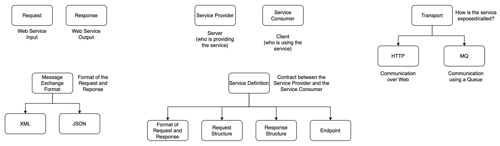

# Web Services



## REST

* Roy Fielding's Dissertation aiming to make best use of HTTP
* **Data Exchange Format:** No restrictions; JSON is popular
* **Transport:** HTTP
* **Service Defintion:** No standard; WADL/Swagger/...

### HTTP
* **HTTP Request**
    * Request Header
    * Request Body
    * HTTP Methods - indicate what action you're doing ([more info](https://developer.mozilla.org/en-US/docs/Web/HTTP/Methods))
        * Methods:
            * `GET` - read
            * `PUT` - update
            * `POST` - create
            * `DELETE` - delete
            * `HEAD` - similar to `GET` but without the response body
            * `CONNECT` - establishes a tunnel to the server identified by the target resource
            * `OPTIONS` - describe communication option
            * `TRACE` - message loop-back to test along the path
            * `PATCH` - apply partial modification
        * Usage:
            ```
            GET     /user
            GET     /user/1
            POST    /user
            PUT     /user/1
            DELETE  /user/1
            ```
* **HTTP Response**
    * HTTP Status Codes (100, 200, 300, 400, 500)
* **Resource**
    * This is vital 
    * Has a URI assigned to each resource
        * e.g. `/user/[id]`
    * Can have different representations
        * XML
        * HTML
        * JSON


### Useful Links for REST

* [RESTful API Guide](https://restfulapi.net/)