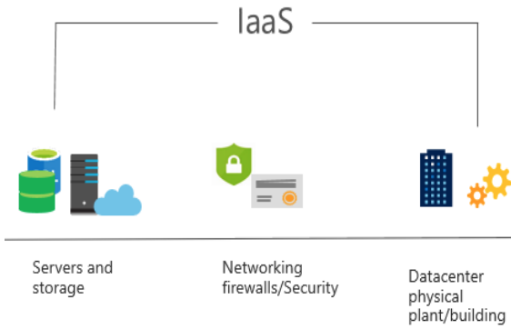
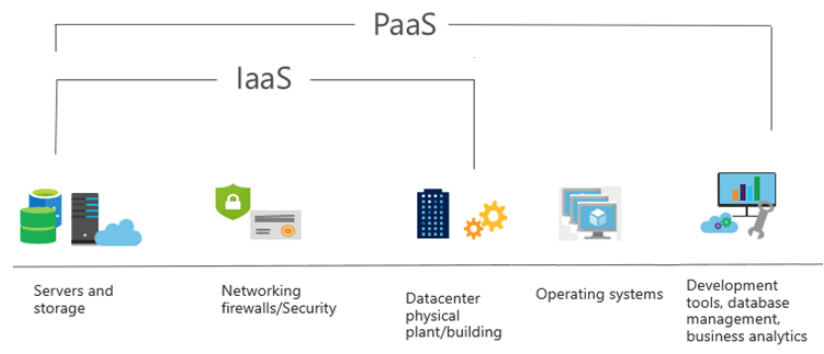
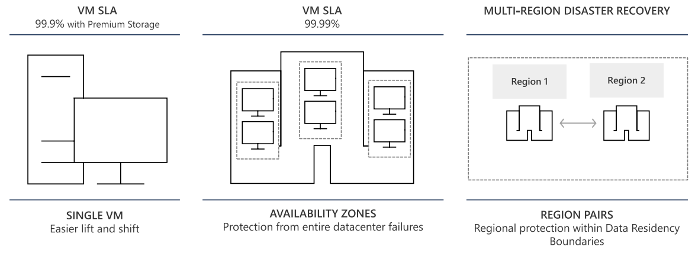
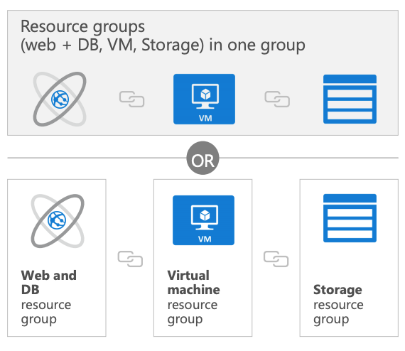
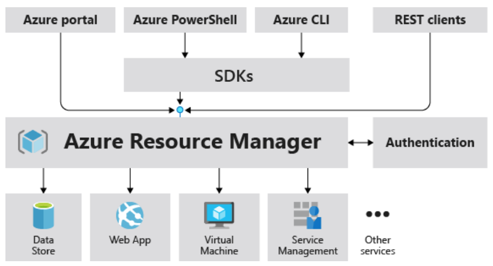
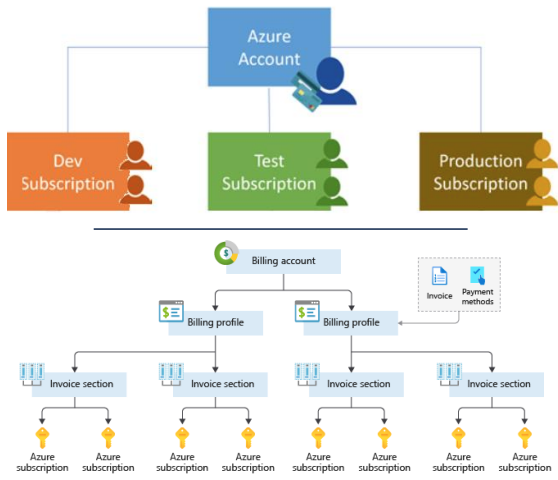

# AZ-900 Azure Fundamentals

* Notes taken from:
  * Exam Reference AZ-900: Microsoft Azure Fundamentals
  * Classroom sessions
* [Study Guide](https://query.prod.cms.rt.microsoft.com/cms/api/am/binary/RE3WzVA)

## Describe Cloud Concepts (20-25%)

### Cloud Models

#### Define Cloud Computing

* The delivery of Computing Services over the internet (Compute, Network, Storage, Analytics), enabling faster innovation, flexible resources, and economies of scale.

#### Describe Public Cloud

* Owned by cloud services or hosting provider
* Provides resources and services to multiple organisations and users
* Accessed via secure network connection (Typically over the Internet)

#### Describe Private Cloud

* Organisations create a cloud environment in their data center
* Organisation is responsible for operating the services they provide
* Does not provide access to users outside of the organisation

#### Describe Hybrid Cloud

* Combines Public and Private Clouds to allow applications to run in the most appropriate location

#### Compare and Contrast the 3 Different Cloud Models

* **Public Cloud**
  * No capital expenditures to scale up
  * Applications can be quickly provisioned and deprovisioned
  * Organisataions pay only for what they use
* **Private Cloud**
  * Hardware must be purchased for start-up and maintenance
  * Organisations have complete control over resources and security
  * Organisations are responsible for hardware maintenance and updates
* **Hybrid Cloud**
  * Provides the most flexibility
  * Organisations determine where to run their applications 
  * Organisations control security, compliance, or legal requirements

### Cloud Benefits and Considerations

#### Cloud Benefits

* High Availability
* Fault Tolerance
* Scalability
* Elasticity
* Global Reach 
* Customer Latency Capabilities
* Agility
* Predictive Cost Considerations

#### Difference between Capital Expenditure (CapEx) and Operational Expenditure (OpEx)

* **Capital Expenditure (CapEx)**
  * The up-front spending of money on physical infrastructure
  * Costs from CapEx have a value that reduces over time
* **Operational Expenditure (OpEx)**
  * The spending and billing of services or products as needed
  * Expenses are deducted in the same year

#### Consumption Based Model

* Cloud service providers operate on a consumption-based model, which means that end users only pay for the resources that they use. Whatever they use is what they pay for.
  * Better cost prediction
  * Prices for individual resources and services are provided
  * Billing is based on actual usage

### Cloud Services

| IaaS | PaaS | SaaS |
|------|------|------|
| The most flexible cloud service   | Focus on Application development   | Pay-as-you-go pricing model   |
| You configure and manage the hardware for your application | Platform management is handled by the cloud provider | Users pay for the software they use on a subscription model |

#### Infrastructure as a Service (IaaS)

 
* Build pay-as-you-go IT Infrastructure by renting services, virtual machines, storage, networks, and operating systems from a cloud provider

#### Platform as a Service (PaaS)

 
* Provides environment for building, testing, and deploying software applications; without focusing on managing underlying infrastructure

#### Software as a Service (SaaS)

 
* Users connect to and use cloud-based apps over the Internet: for example, Microsoft Office 365 email and calendar

#### Identify a Service Type Based on a Use Case

#### Describe the Shared Responsibility Model

There are different Cloud Models available: **On Premise**, **Hybrid**, and **Private**.  

There are also different Services available **Infrastructure as a Service (IaaS)**, **Platform as a Service (PaaS)**, **Software as a Service**.

#### Describe Serverless Computing

* With **Serverless Computing Applications** the cloud service provider automatically provisions, scales and managess the infrastructure required to run the code. 
* **Azure Functions**
  * Code running your service and not the underlying platform or infrastructure. It creates infrastructure based on an event
* **Azure Logic Apps**
  * Cloud Service that helps you automate and orchestrate tasks, business processes, and workflows when you need to integreate apps, data, systems, and services

---

## Describe Core Azure Services (15-20%)

### Azure Architectural Components

#### Regions

* Regions are made up of one or more datacentres in close proximity
* Provide flexibility and scale to reduce customer latency
* Preserve data residency with comprehensive compliance offering
* Azure has 60+ regions, representing over 140 countries

#### Region Pairs

* At least 300 miles of separation between region pairs
* Automatic replication for some services
* Prioritized region recovery in the event of outage
* Updates are rollout sequentially to minimize downtime
* More details:
  * https://aka.ms/PairedRegions

#### Availability Options

#### Availability Zones

* Provide protection against downtime due to datacenter failure
* Physically separate datacentres within the same region
* Each datacenter is equipped with independent power, cooling, and networking
* Connected through private fiber-optic networks

#### Azure Resources

* Azure resources are components like storage, virtual machines, and networks that are available to build cloud solutions
  * Virtual Machines
  * Storage Accounts
  * Virtual Networks
  * App Service 
  * SQL Databases
  * Functions

#### Resource Groups

* Is a container to manage and aggragate resources in a single unit
  * Resources can only exist in only **one** resource group
  * Resources can exist in different regions
  * Resources can be moved to different resource groups
  * Applications can utilize multiple resource groups

#### Azure Resource Manager

* Azure Resource Manager (ARM) provides a management layer that enables you to create, update, and delete resources in your Azure subscriptions

#### Azure Subscriptions

* An Azure Subscription provides you with authenticated and authorized access to Azure accounts
  * **Billing Boundary:** generate separate billing reports and invoices for each subscription
  * **Access Control Boundary:** Manage and controll access to the resources that users can provision with sepcific subscriptions

#### Management Groups

* Management groups can include multiple Azure subscriptions
* Subscriptions inherit conditions applied to the management group
* 10,000 management groups can be supported in a single directory
* A management group tree can support up to six levels of depth

### Core Azure Workload Products

#### Azure Compute Services

* Azure **compute** is an on-demand computing service that provides computing resources such as disks, processors, memory, networking, and operating systems
  * Virtual Machines
  * App Services
  * Container Instances
  * Azure Kubernetes Services (AKS)
  * Windows Virtual Machines

#### Azure Virtual Machines

* Are software emulations of physical computers
  * Includes a virtual processor, memory, storage, and networking
  * IaaS offering that provides total control and customization
* TODO Walkthrough: Create a Virtual Machine:
  * Create a virtual machine
  * Connect to the virtual machine
  * Install the web server role and test

#### Azure App Services

* Is a fully managed platform to build, deploy, and scale web apps and APIs quickly
  * Works with .Net, .NetC Core, Node.js, Java, Python, or PHP
  * PaaS offering with enterprise-grade performance, security, and compliance requirements
* TODO Walkthrough: Create an App Service
  * Create a Web App using a Docker image
  * Test th Web App

#### Azure Container Service

* Are light-weight, virtualized environments that does not require operating system maangement, and can respond to changes on demand
  * **Azure Container Instances:** a PaaS offering that runs a container in Azure without the need to manage a virtual machine or additional services
  * **Azure Kubernetes Service:** an orchestration service for containers with distributed architecture and large volumes of containers
* TODO Walkthrough: Deploy Azure Container Instances
  * Using Azure Portal create, configure, and deploy a Docker container to an Azure Container Instance. The container will deploy a Hello HTML Page
  * Create a Container Instance
  * Deploy the container and test

#### Windows Virtual Desktop

* Is a desktop and app virtualization that runs in the cloud
  * Create a full desktop virtualization environment without having to run additional gateway servers
  * Publish unlimited host pools to accommodate diverse workloads
  * Reduce costs with pooled, multi-session resources

#### Azure Networking Services

* **Azure Virtual Network (VNet)** enables Azure resources to communicated with each other, the internet, and on-premises networks
* **Virtual Private Network Gateway (VPN)** is used to send encrypted traffic between an Azure virtual network and an on-premise location over the public internet
* **Azure Express Route** extends on-premises networks into Azure over a private connection that is facilitated by a connectivity provider
* TODO Walkthrough: Create a Virtual Network
  * Create a virtual network with two virtual machines and then test connection between the machines
  * Create a virtual network
  * Create two virtual machines
  * Test the connection

#### Azure Storage Services

* **Container Storage (blob)** is optimised for storing massive amounts of unstructured data, such as text, or binary data
* **Disk Storage** provides disks for virtual machines, applications, and other services to access and use
* **Azure Files** sets up a highly available network file shares that can be accessed by using the standard server message block (SMB) protocol

#### Azure Storage Access Tiers

* **Hot**
  * Optimised for storing data that is accessed frequently
* **Cool**
  * Optimised for storing data that is infrequently accessed and stored for at least 30 days
* **Archive**
  * Optimised for storing data that is rarely accessed and stored for at least 180 days with flexible latency requirements
* TODO Walkthrough: Create Blob Storage
  * Create a storage account with a blob storage container. Work with blob files
  * Create a storage account
  * Work with blob storage
  * Monitor the storage account

#### Azure Database Services

* **Azure Cosmos Database**
  * Is a globally-distributed database service that elastically and independently scales throughput and storage
* **Azure SQL Database**
  * Is a relational database as a service (DaaS) based on the latest stable version of the Microsoft SQL Sever database engine
* **Azure Database for MySQL**
  * Is a fully-mangaged MySQL database service for app developers
* **Azure Database for PostgreSQL**
  * Is a relational database service based on the open-source Postgres database engine

#### Azure SQL Managed Instance

* Allows existing SQL Server customers to lift and shift their on-premises applications to the cloud with minimal applciation and database changes
  * Fully managed and evergreen PaaS
  * Preserves all PaaS capabilities (automatic patching and version updates, atuomated backups, and high availability)
  * Exchange existing licenses for discounted rates on SQL Managed Instance using the Azure Hybrid Benefit
* TODO Walkthrough: Create a SQL Database
  * Create a SQL database in Azure and then query the data in that database
  * Create the database
  * Query the database

#### Explore Azure Marketplace

* Allows customers to find, try, purchase, and provision applications and services from hundreds of leading service providers, which are all certified to run on Azure
  * Open source container platforms
  * Virtual machine and database images
  * Applcation build and deployment software
  * Developer Tools
  * Much more...
---

## Describe Core Solutions and Management Tools on Azure (10-15%)

---

## Describe General Security and Netowrk Security Features (10-15%)

---

## Describe Identity, Governance, Privacy, and Compliance Features (20-25%)

---

## Describe Azure Cost Management and Service Level Agreements (10-15%)

---

# Useful Links

* [Azure Fundamentals Videos for Parts 1 to 6](https://docs.microsoft.com/en-gb/learn/paths/az-900-describe-cloud-concepts/)
* [Microsoft Build: Business Continuity and Disaster Recovery (BCDR): Azure Paired Regions](https://docs.microsoft.com/en-gb/azure/best-practices-availability-paired-regions)
* [Products Available by Region](https://azure.microsoft.com/en-gb/global-infrastructure/services/)
* [Microsoft Build: Get Started with Azure CLI](https://docs.microsoft.com/en-gb/cli/azure/get-started-with-azure-cli)
* [Microsoft Build: Overview of Azure Cloud Shell](https://docs.microsoft.com/en-gb/azure/cloud-shell/overview)
* [Microsoft Build: Azure Compliance Documentation](https://docs.microsoft.com/en-gb/azure/compliance/)
* [Azure Pricing Calculator](https://azure.microsoft.com/en-gb/pricing/calculator/)
* [Total Cost of Ownership Calculator](https://azure.microsoft.com/en-gb/pricing/tco/calculator/)
* [Microsoft Build: Azure for AWS Professionals](https://docs.microsoft.com/en-gb/azure/architecture/aws-professional/)
* [Microsoft Build: GCP to Azure Services Comparison](https://docs.microsoft.com/en-gb/azure/architecture/gcp-professional/services)
* [Microsoft Build: Azure for AWS Professionals](https://docs.microsoft.com/en-gb/azure/architecture/aws-professional/)
* [Manage Services with the Azure Portal](https://docs.microsoft.com/en-gb/learn/modules/tour-azure-portal/5-exercise-navigate-the-portal)