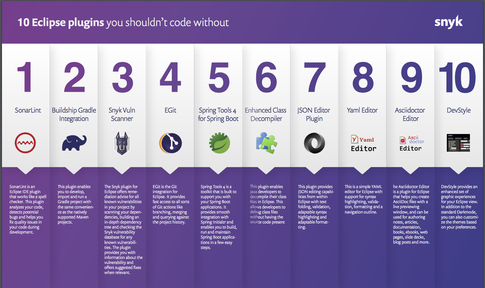

# UsefulProgrammingThings
This repo contains all the things that help me effectively do my programming stuff. 

## Software Design 
* [The 12 Factor App](https://12factor.net/)
* [Big Ball of Mud (a.k.a. Spaghetti Code, Shanty Town)](http://www.laputan.org/mud/)

## Spring 
* [Annotations CheatSheet](https://www.jrebel.com/blog/spring-annotations-cheat-sheet)

## Markdown
* [Markdown Cheatsheet](https://wordpress.com/support/markdown-quick-reference/)
* [Code blocks](https://support.codebasehq.com/articles/tips-tricks/syntax-highlighting-in-markdown)
* [Markdown Table Generator](https://www.tablesgenerator.com/markdown_tables)

## Eclipse Plugins 

